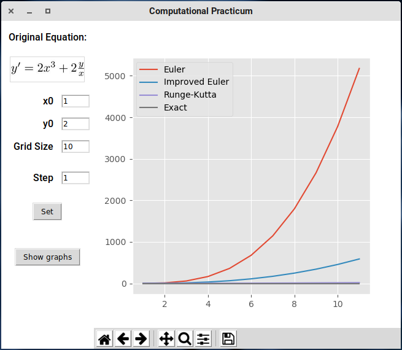
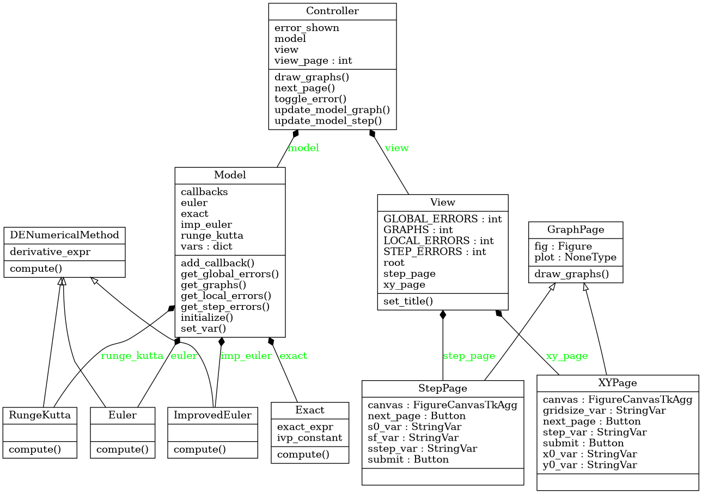

# DE Computational Practicum

The initial value problem in question: $y' = 2x^3 + 2\frac{y}{x}$,  $y(1) = 2$,  $x \in (1, 10)$.

**Important**: throughout the paper the following conditions should be respected:

* $x \neq 0$

## Exact Analytical Solution

Let's transform the equation into the form of a linear non-homogeneous first-order ODE:

$y' - \frac{2}{x} y = 2x^3 \hspace{3em} (1)$

The complementary equation for $(1)$ is:

$y_1' - \frac{2}{x} y_1 = 0 \hspace{3em} (2)$

$\frac{dy_1}{y_1} = \frac{2dx}{x}$

$\ln{|y_1|} = 2 \ln{|x|} + C$

$y_1 = C x^2$, we need one solution, let $C = 1$ and $y_1 = x^2$.


Let $y = ux^2$, therefore, $(1)$ is:

$u' x^2 = 2x^3$

$du = 2x dx$

$u = x^2 + C$

Substituting $u$ into $y = u x^2$ we obtain that $y = x^4 + C x^2$    (**exact solution**)

Solving the initial value problem: $2 = 1 + C \cdot 1 \Rightarrow C = 1$

There are **no points of discontinuity** on the interval $(1, 10)$.


## Application

To analyze the accuracy of the numerical methods for solving DEs, the following application was developed:




It shows the three numerical methods (Euler, Improved Euler, Runge-Kutta) in action, as well as the exact solution derived above. Clicking on _Show local errors_ will plot the graph of approximation errors for each method.

The user may change the _initial conditions_ ($x_0$, $y_0$) at their convenience.
**Important**: to ensure that the program produces the correct result, make sure that the point $( x_0; y_0 )$ really does belong to the graph of the Initial Value Problem solution.

The user may also set the _grid size_. It means that the displayed graphs are plotted for $x \in [x_0; x_0 + grid\_size]$. The precision of plotting may also be specified by changing the _step_.


The application was built in Python 3.7 using the GUI package `tkinter` and the plotting library `matplotlib`. The code adheres to the _OOP paradigm_ and _SOLID_ principles, as well as implements the _MVC_ pattern.

The **UML diagram** of the source code structure follows:


This is the base class for computational methods, `DENumericalMethod`:

```python
class DENumericalMethod:
    def __init__(self, derivative_expr):
        self.derivative_expr = derivative_expr

    def compute(self, x0, y0, x_limit, step):
        raise NotImplemented('Override this method in child classes.')
```

The class for the exact solution doesn't inherit from `DENumericalMethod`, but follows the same interface:

```python
class Exact:
    def __init__(self, exact_expr):
        self.exact_expr = exact_expr

    def compute(self, x0, y0, x_limit, step):
        x = x0
        xs = [x]
        ys = [y0]

        while x < x_limit:
            x += step
            xs.append(x)
            ys.append(self.exact_expr(x))

        return xs, ys
```


The main classes of the application are, of course, `Model`, `View` and `Controller`:

```python
# comp/model.py

class Model:
    def __init__(self):
        self.vars = {
            'x0': 1,
            'y0': 2,
            'grid_size': 10,
            'step': 1,
        }

        self.callbacks = {
            'x0': [],
            'y0': [],
            'grid_size': [],
            'step': [],
        }

        self.euler = Euler(y_prime)
        self.imp_euler = ImprovedEuler(y_prime)
        self.runge_kutta = RungeKutta(y_prime)
        self.exact = Exact(y_exact)

		# ... callback-related code ...

    def get_graphs(self):
        graphs = []
        for method in (self.euler, self.imp_euler, self.runge_kutta, self.exact):
            graphs.append(method.compute(self.vars['x0'],
                                         self.vars['y0'],
                                         self.vars['x0'] + self.vars['grid_size'],
                                         self.vars['step']))

        return graphs

    def get_errors(self):
        graphs = []
        xs, exact = self.exact.compute(self.vars['x0'],
                                       self.vars['y0'],
                                       self.vars['x0'] + self.vars['grid_size'],
                                       self.vars['step'])

        for method in (self.euler, self.imp_euler, self.runge_kutta, self.exact):
            _, points = method.compute(self.vars['x0'],
                                       self.vars['y0'],
                                       self.vars['x0'] + self.vars['grid_size'],
                                       self.vars['step'])
            graphs.append((xs, [abs(ex - act) for ex, act in zip(exact, points)]))

        return graphs
```


```python
# comp/view.py

class View:
    def set_x0(self, x0):
        self.x0_var.set(str(x0))

    # ... other set methods ..

    def draw_graphs(self, graphs):
        self.plot.clear()

        for xs, ys in graphs:
            self.plot.plot(xs, ys)

        self.plot.legend(['Euler', 'Improved Euler', 'Runge-Kutta', 'Exact'])
        self.canvas.draw()

    def __init__(self, root):
        self.fig = Figure(figsize=(5, 5), dpi=100)
        self.plot = self.fig.add_subplot(111)

        root.title('Computational Practicum')
        root.configure(background='white')

        top_frame = tk.Frame(root)
        top_frame.configure(background='white')
        top_frame.pack(side=tk.LEFT, fill=tk.BOTH, expand=True)

        eq_label = tk.Label(top_frame, text='Original Equation:', font=LARGE_FONT)
        eq_label.grid(row=0, column=0, columnspan=2, sticky='w', padx=10, pady=15)
        eq_label.configure(background='white')

        img_size = (EQUATION_WIDTH, EQUATION_WIDTH // EQUATION_W_TO_H)
        img = ImageTk.PhotoImage(Image.open(EQUATION_PICTURE).resize(img_size,
                                                                     Image.ANTIALIAS))
        equation = tk.Label(top_frame, image=img)
        equation.image = img
        equation.grid(row=1, column=0, columnspan=2, pady=5, padx=10)

        self.canvas = FigureCanvasTkAgg(self.fig, root)
        self.canvas.draw()
        self.canvas.get_tk_widget().pack(side=tk.LEFT, fill=tk.BOTH, expand=True)

        toolbar = NavigationToolbar2Tk(self.canvas, root)
        toolbar.update()
        self.canvas._tkcanvas.pack(side=tk.TOP, fill=tk.BOTH, expand=True)
				
        # ... textfields and input controls ...
```


The controller is the main class that ties together the model and the view:

```python
# comp/controller.py

class Controller:
    def draw_graphs(self):
        print(self.error_shown)
        if self.error_shown:
            self.view.draw_graphs(self.model.get_errors())
        else:
            self.view.draw_graphs(self.model.get_graphs())

    def on_x0_change(self, x0):
        self.view.set_x0(x0)
        self.draw_graphs()

    def on_y0_change(self, y0):
        self.view.set_y0(y0)
        self.draw_graphs()

    def on_grid_size_change(self, grid_size):
        self.view.set_grid_size(grid_size)
        self.draw_graphs()

    def on_step_change(self, step):
        self.view.set_step(step)
        self.draw_graphs()

    def update_model(self):
        self.model.set_var('x0', float(self.view.x0_var.get()))
        self.model.set_var('y0', float(self.view.y0_var.get()))
        self.model.set_var('grid_size', float(self.view.gridsize_var.get()))
        self.model.set_var('step', float(self.view.step_var.get()))

    def toggle_error(self):
        self.error_shown = not self.error_shown
        self.view.toggle_error.configure(text='Show graphs' if self.error_shown else 'Show local errors')
        self.draw_graphs()

    def __init__(self, root):
        self.error_shown = False

        self.model = Model()
        self.model.add_callback('x0', self.on_x0_change)
        self.model.add_callback('y0', self.on_y0_change)
        self.model.add_callback('grid_size', self.on_grid_size_change)
        self.model.add_callback('step', self.on_step_change)

        self.view = View(root)
        self.view.submit.configure(command=self.update_model)
        self.view.toggle_error.configure(command=self.toggle_error)

        self.model.initialize()
        self.view.draw_graphs(self.model.get_graphs())
```


## Error analysis

Upon pressing the _Show local errors_ button, the user can view the errors of particular methods. Euler's method gives the largest error, growing like a square function, while the others produce mostly linear results on the interval $(1, 10)$ with the step $1$. Reducing the step to $0.1$ significantly reduces the error of the Euler's method, but still retains the quadratic growth nature.

The methods ordered by accuracy (from lowest to highest):

1. Euler
2. Improved Euler
3. Runge-Kutta
4. Exact


## Credits

This paper and the source code have been written by Lev Chelyadinov, B18-06.
The source code may be found on [GitHub](https://github.com/illright/de-practicum-f19).