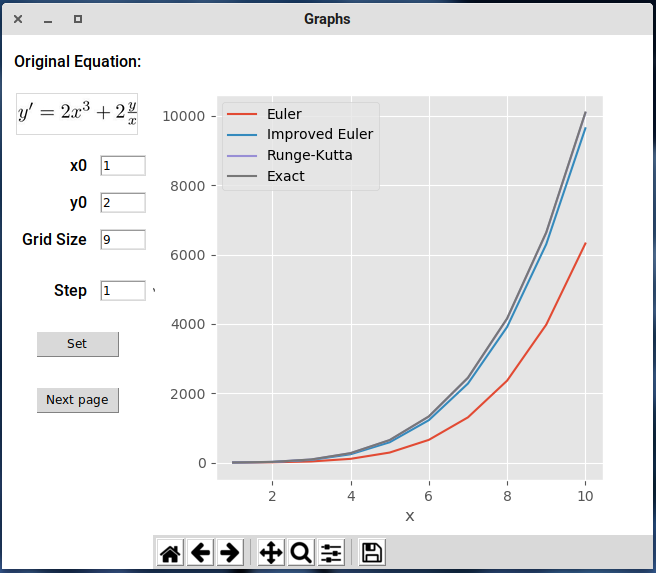
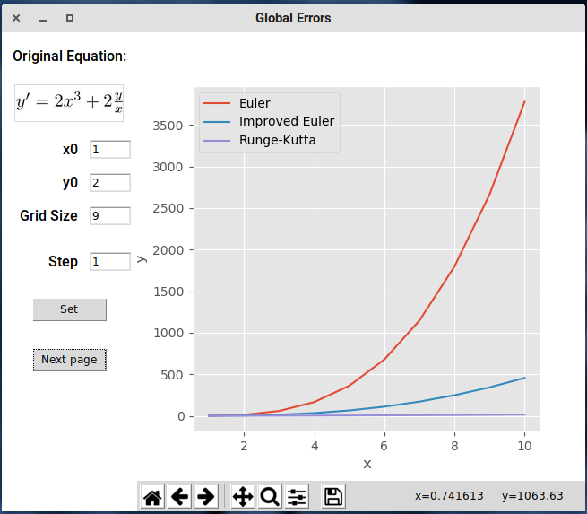
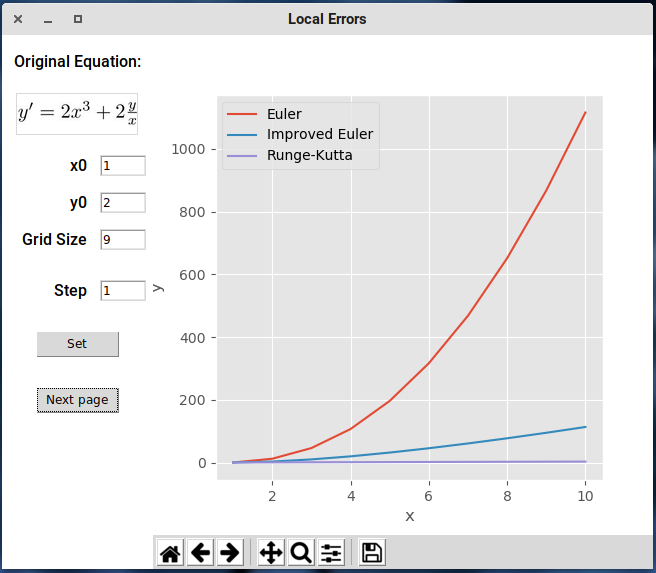
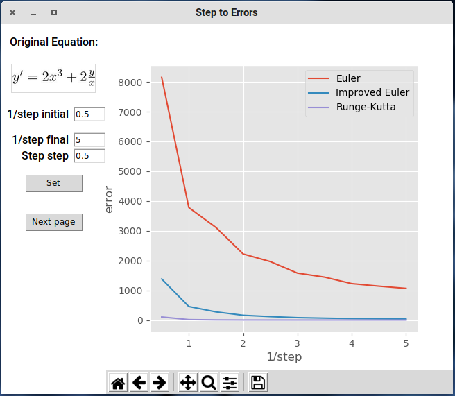

# DE Computational Practicum

This paper and the source code have been written by Lev Chelyadinov, B18-06.
The source code may be found on [GitHub](https://github.com/illright/de-practicum-f19).


The initial value problem in question: $y' = 2x^3 + 2\frac{y}{x}$,  $y(1) = 2$,  $x \in (1, 10)$.

**Important**: throughout the paper the following conditions should be respected:

* $x \neq 0$

## Exact Analytical Solution

Let's transform the equation into the form of a linear non-homogeneous first-order ODE:

$y' - \frac{2}{x} y = 2x^3 \hspace{3em} (1)$

The complementary equation for $(1)$ is:

$y_1' - \frac{2}{x} y_1 = 0 \hspace{3em} (2)$

$\frac{dy_1}{y_1} = \frac{2dx}{x}$

$\ln{|y_1|} = 2 \ln{|x|} + C$

$y_1 = C x^2$, we need one solution, let $C = 1$ and $y_1 = x^2$.


Let $y = ux^2$, therefore, $(1)$ is:

$u' x^2 = 2x^3$

$du = 2x dx$

$u = x^2 + C$

Substituting $u$ into $y = u x^2$ we obtain that $y = x^4 + C x^2$    (**exact solution**)

Solving the initial value problem: $2 = 1 + C \cdot 1 \Rightarrow C = 1$

There are **no points of discontinuity** on the interval $(1, 10)$.


## Application

To analyze the accuracy of the numerical methods for solving DEs, the following application was developed:










It shows the three numerical methods (Euler, Improved Euler, Runge-Kutta) in action, as well as the exact solution derived above. 

The application consists of four pages, one may cycle through them by clicking _Next page_.
The pages are:

* graphs
* global errors
* local errors
* steps to errors

The user may change the _initial conditions_ ($x_0$, $y_0$) at their convenience.
**Important**: to ensure that the program produces the correct result, make sure that the point $( x_0; y_0 )$ really does belong to the graph of the Initial Value Problem solution.

The user may also set the _grid size_. It means that the displayed graphs are plotted for $x \in [x_0; x_0 + grid\_size]$. The precision of plotting may also be specified by changing the _step_.


The application was built in Python 3.7 using the GUI package `tkinter` and the plotting library `matplotlib`. The code adheres to the _OOP paradigm_ and _SOLID_ principles, as well as implements the _MVC_ pattern.

The SOLID principles followed are:

* Single Responsibility Principle
  The app contains three main classes: Model, View, Controller. Each of those does only what it is supposed to do.
* Liskov substitution Principle
  The numerical methods are interchangeable in code since they all have the same interface.
* Interface Segregation Principle
  The interface of numerical methods doesn't force people to implement any unrelated methods.

The **UML diagram** of the source code structure follows:


This is the base class for computational methods, `DENumericalMethod`:

```python
class DENumericalMethod:
    def __init__(self, derivative_expr):
        self.derivative_expr = derivative_expr

    def compute(self, x0, y0, x_limit, step):
        raise NotImplemented('Override this method in child classes.')
```

The class for the exact solution doesn't inherit from `DENumericalMethod`, but follows the same interface:

```python
class Exact:
    def __init__(self, exact_expr, ivp_constant):
        self.exact_expr = exact_expr
        self.ivp_constant = ivp_constant

    def compute(self, x0, y0, x_limit, step):
        C = self.ivp_constant(y0, x0)
        x = x0
        xs = [x]
        ys = [self.exact_expr(x, C)]

        while x < x_limit:
            x += step
            xs.append(x)
            ys.append(self.exact_expr(x, C))

        return xs, ys
```


## Error analysis

The local error growth of each method is as follows:

* The methods ordered by accuracy (from lowest to highest):Euler: quadratic growth, the largest error
* Improved Euler: quadratic growth
* Runge-Kutta: linear growth, the smallest error