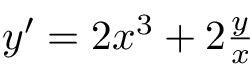
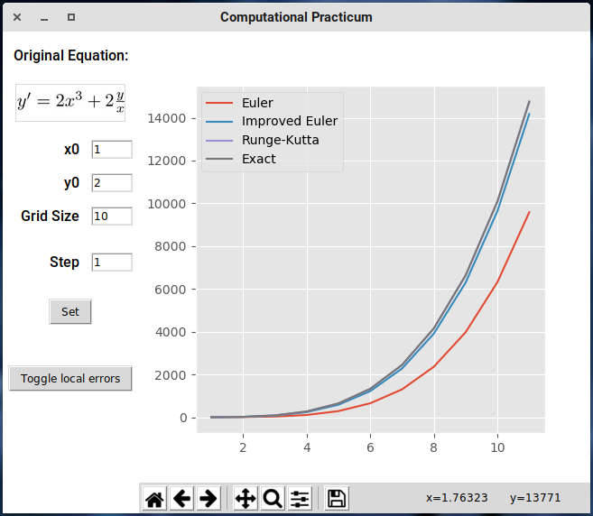

# DE Computational Practicum

It is devoted to the analysis of several numeric method for solving the following equation:

The methods considered are:

* Euler
* Improved Euler
* Runge-Kutta
* Exact Solution

It features a GUI to plot the resulting graphs and local errors:

The source code is built using the MVC pattern.
